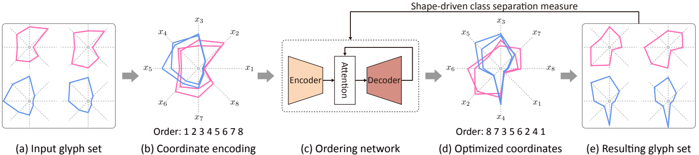
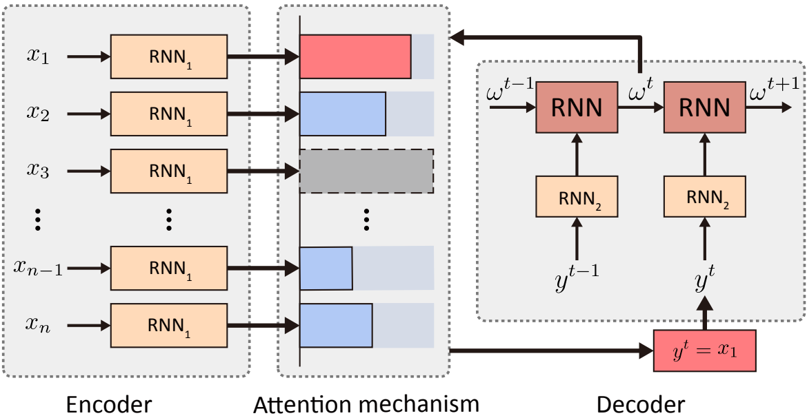

# Shape-driven-Coordinate-Ordering



## Introduction
We present a neural optimization model trained with reinforcement learning to solve the coordinate ordering problem for sets of star glyphs. Given a set of star glyphs associated to multiple class labels, we propose to use shape context descriptors to measure the perceptual distance between pairs of glyphs, and use the derived silhouette coefficient to measure the perception of class separability within the entire set. To find the optimal coordinate order for the given set, we train a neural network using reinforcement learning to reward orderings with high silhouette coefficients.

<div align=center>

</div>

## Dependencies
* Python 3.7
* Pytorch 1.1.0
* numpy
* matplotlib
* networkx
* scipy
* copy
* tqdm
* prettytable


## Usage

All codes are tested under PyTorch 1.1.0 and Python 3.7 on Ubuntu 18.04.
### Training
```
./scripts/train.sh
```
### Testing
```
./scripts/test.sh
```
### Just generate data
```
./scripts/generate.sh
```


## File structure:

* **data/**: Dataset folder, generated by code.
* **vis/**: Training result.
* **vis_valid/**: Testing result.
* **evaluate/**: Code to evaluate the visualization.
* **shape_task/**: Code to train shape context distance prediction network, check [README](./shape_task/README.md) for more detial.
* **scripts/**: Some scripts to train/test network.
---
* **tools.py**: Consists of 2 parts: evaluation functions and painting functions.
* **model.py**: Define the network structure.
* **vis.py**: Laod/generate training/testing data, update mask in network.
* **train.py**: Main code to run the network, we set some parameters to contorll the training.


### Parameters of train.py
    ========= Task setting =========
    --just_test: bool, True when test the network without training
    --just_generate: bool, True when only generate data
    --note: string, any words you want to say
        when the train.py is running, it will create a folder to store the result, and the note string will be a part of the folder's name
    --use_cuda: bool, use CUDA to run network
        True
        False
    --cuda: string, the id of GPU you want to use
        "0"
    --checkpoint: string, the location of pre-trained network model
        If the path for a model of network is "./netwrok/model/actor.pt", then the checkpoint should be "./network/model/"

    ========= Training/testing setting =========
    --train_size: int, the number of training data
    --valid_size: int, the number of testing data
    --epoch_num: int, epoch num
    --batch_size: int, batch size, default as 128

    --encoder_hidden: int, the features dimension of the encoder
    --decoder_hidden: int, the features dimension of the decoder
    --actor_lr: float, learning rate of actor
    --critic_lr: float, learning rate of critic

    --dropout: float, dropout probability
    --max_grad_norm: float, max norm of the gradients
    --n_process_blocks: int, times of glimpse in critic network
    --layers: int, the number of GRU layer in actor/critic network

    ========= Data setting =========
    --dim_num_min: int, the min num of data dimension for each data group
    --dim_num_max: int, the max num of data dimension for each data group
    --dim_num_step: int, the step between min and max dim
        these settings will generate each data group with dimension in range(min, max+1, step)
        
    --data_num_min: int, the min num of data for each data group
    --data_num_max: int, the max num of data for each data group
    --data_num_step: int, the step between min and max dim
        these settings will generate each data group with data num in range(min, max+1, step)
        
    --label_num_min: int, the min num of class labels for each data group
    --label_num_max: int, the max num of class labels for each data group
    --label_num_step: int, the step between min and max dim
        these settings will generate each data group with class labels num in range(min, max+1, step)
        
    --standard: float, the standard of data, we will generate each data group based on gaussian distribution
        check [vis.py](./vis.py) for more detial

    --data_type: string, about the numder distribution of different classes
        "dis": the num of each class is the same, we use for 'star'
        "ran": the num of each class is random, we use for 'radivz'

    --with_label: bool, True if the network will train with label data

    ========= Visualization setting =========
    --vis_type: string, visualization type
        "star" : set the visulization type as star glyph
        "radviz" : set the visulization type as radviz
        
    --reward_type: string, the reward want to use
        "sc_sil" : use the silhouette coefficient as reward, we use for 'star'
        "rad_dbr" : use the ratio between the Davies-Bouldin index as reward, we use for 'radviz'
            check [tools.py](./tools.py) for more detial
        
    
Example:

    python trainer.py \
        \
        --just_test=False \
        --just_generate=False \
        \
        --use_cuda=True \
        --cuda=0 \
        \
        --train_size=64000 \
        --valid_size=10 \
        --batch_size=128 \
        --epoch_num=200 \
        \
        --vis_type=star \
        --reward_type=sc_sil \
        --encoder_type=rn2 \
        --data_type=dis \
        --with_label=True \
        --share_RNN=True \
        \
        --dim_num_min=16 \
        --dim_num_max=24 \
        --dim_num_step=1 \
        \
        --data_num_min=8 \
        --data_num_max=8 \
        --data_num_step=1 \
        \
        --label_num_min=2 \
        --label_num_max=2 \
        --label_num_step=1 \
        \
        --label_type=center \
        --standard=0.1 \
        \
        --note=train \
        \
        --encoder_hidden=128 \
        --decoder_hidden=128


This command means you want to **train** the network of **star** glyph, the training data size is **64000**, the testing data size is **10**, reward type is **sc_sil**. The code will generate each data group with dimension **from 16 to 24**, each data group has **8** data and **2** classes/labels in total.

Then it will generate a folder unber `vis/` folder to store the training result. If you set `just_test` as True, it will generate a folder under `vis_valid/`
The folder structure of `pack` looks like this:

    vis/
        star/  <--- vis_type='star'
            24/  <--- dim_num_max=24
                sc_sil-rn2-dis-True-True-[16-24]d-[8-8]n-[2-2]c-center-0.1-note-*some-useless-words*-*the-date-run-this-code*/ <--- the folder create by our code
                    checkpoints/    <--- store models of each epoch
                        0/          <--- the epoch num
                        1/
                        ...
                    render/         <--- store the testing result of each epoch
                        0/  
                        1/
                        ...
                    img/            <--- curves of loss and reward

The `data/` folder contain the training and testing data, the folder structure of `data` looks like this:

    data/
        star/
            train-16d-2c-8n-1000-dis-0.1/
                data.txt        <--- data
                label.txt       <--- the class label info of each data in each data group

Under these folders, we have many kinds for dataset, `train-16d-2c-8n-1000-dis-0.1` means the training dataset with 1000 data, each data group has 8 data, 16 dimensions and 2 classes, data type is 'dis', which means the number of each class in the data group is the same, the standard rate of each data group is 0.1. `valid-24d-3c-100n-500-ran-0.15` means the testing dataset with 500 data, each data group has 100 data, 24 dimensions and 3 classes, data type is 'ran', which means the number of each class in the data group is random, the standard rate of each data group is 0.15.

## Citation
Please cite the paper in your publications if it helps your research:
```
@article{hu2021shape,
  title={Shape-driven Coordinate Ordering for Star Glyph Sets via Reinforcement Learning},
  author={Hu, Ruizhen and Chen, Bin and Xu, Juzhan and Van Kaick, Oliver and Deussen, Oliver and Huang, Hui},
  journal={IEEE Transactions on Visualization and Computer Graphics},
  year={2021},
  publisher={IEEE}
}
```
## License
Our code is released under MIT License. See LICENSE file for details.


## Acknowledgements
Thanks to [mveres01/pytorch-drl4vrp](https://github.com/mveres01/pytorch-drl4vrp) for getting the start of our code.
