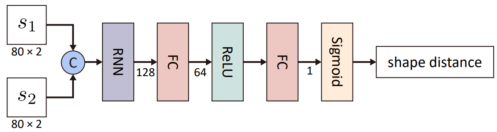

# Shape context distance prediction network



## Dependencies
* Python 3.7
* Pytorch 1.1.0
* numpy
* matplotlib
* scipy
* copy
* tqdm
* prettytable


## Usage

All codes are tested under PyTorch 1.1.0 and Python 3.7 on Ubuntu 18.04.
### Training
```
./scripts/train.sh
```
### Testing
The warning and number of console output for testing scripts are meaningless, the final output will be saved under `./shape/xxx/render` folder.
```
./scripts/test.sh
```
### Just generate data
```
./scripts/generate.sh
```
### Draw the compare curve as Fig.7 in paper
```
./scripts/curve.sh
```


## File structure:

* **data/**: Dataset folder, generated by code.
* **shape/**: Training/testing result and models.
* **scripts/**: Some scripts to train/test network.
* **compare/**: Script to draw curve and save image.
---
* **shape.py**: Use to generate training/testing data.
* **shape_context.py**: Code to compute shape_context, similar with the code in `../evaluate/shape_context.py`
* **shape_valid.py**: Laod/generate training/testing data, update mask in network.
* **shape_train.py**: Main code to run the network, we set some parameters to contorll the training.
* **curve.py**: Test the trained network for curve ploting.


### Some parameters of shape_train.py
    ========= Input setting =========
    --net_type: string, the network sturcture type
        "fcn2": "SAMPLE"
        "fc": "ORIG"